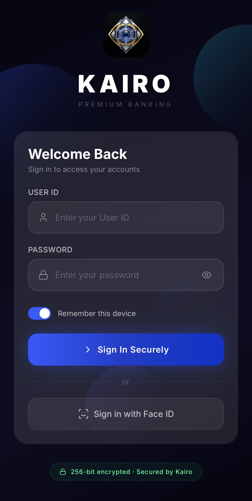
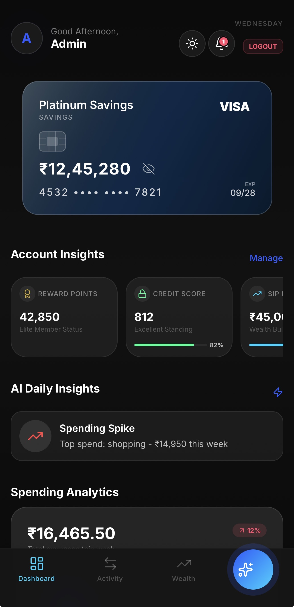
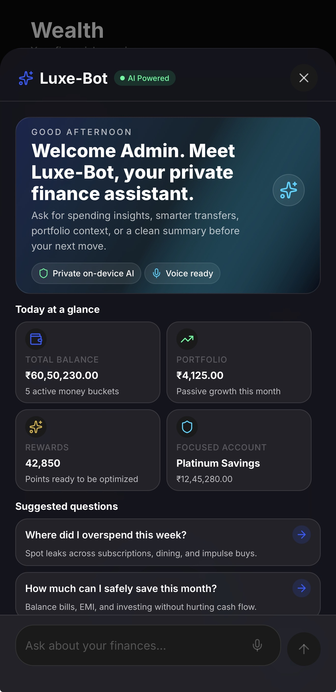
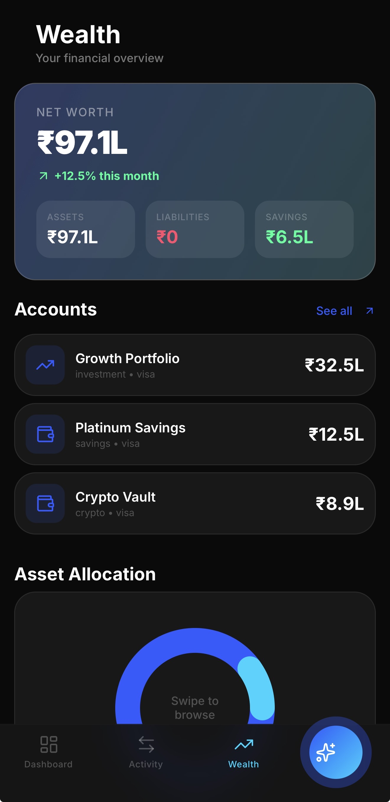
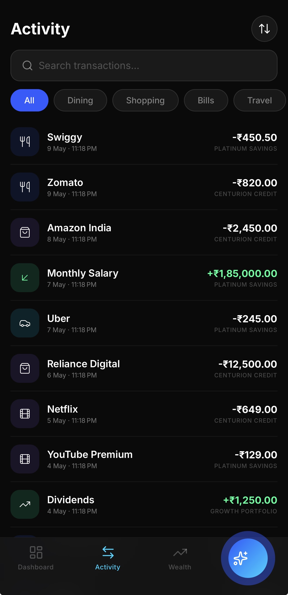
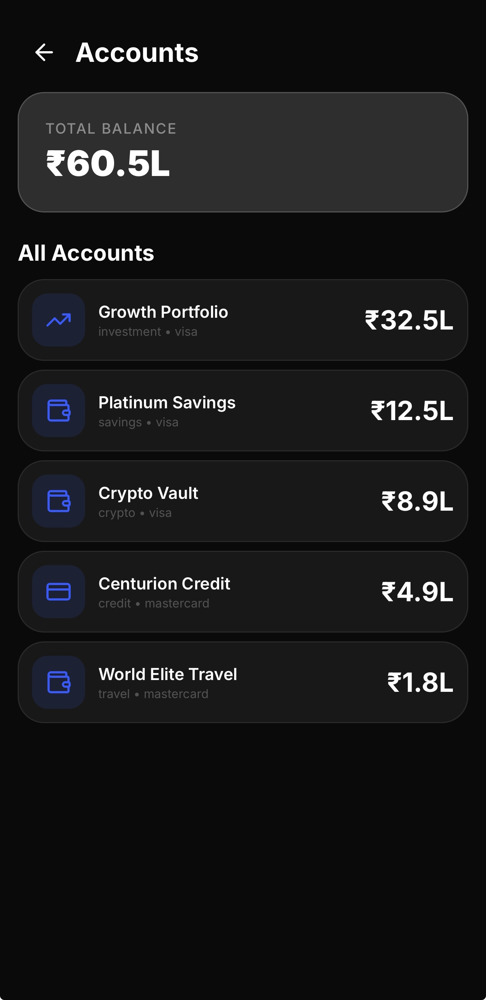
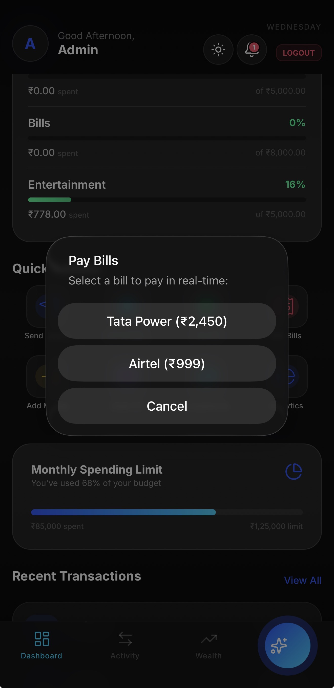

# Kairo — AI-Powered Personal Finance OS

<p align="center">
  
  
  
  
  
</p>

<p align="center">
  <strong>Kairo</strong> is a premium mobile banking application that combines traditional financial management with embedded AI capabilities. All data stays on-device — your financial privacy is non-negotiable.
</p>

<p align="center">
  <a href="#-visual-preview">Visual Preview</a> ·
  <a href="#-features">Features</a> ·
  <a href="#-tech-stack">Tech Stack</a> ·
  <a href="#-getting-started">Getting Started</a> ·
  <a href="#-architecture">Architecture</a> ·
  <a href="#-ai-engine">AI Engine</a>
</p>

---

## 📱 Visual Preview

<table align="center">
  <tr>
    <td align="center"><b>Login & Security</b></td>
    <td align="center"><b>Elite Dashboard</b></td>
    <td align="center"><b>Luxe-Bot AI</b></td>
  </tr>
  <tr>
    <td></td>
    <td></td>
    <td></td>
  </tr>
  <tr>
    <td align="center"><b>Wealth Management</b></td>
    <td align="center"><b>Transaction History</b></td>
    <td align="center"><b>Account Portfolio</b></td>
  </tr>
  <tr>
    <td></td>
    <td></td>
    <td></td>
  </tr>
  <tr>
    <td colspan="3" align="center"><b>Bills & Reminders</b></td>
  </tr>
  <tr>
    <td colspan="3" align="center"></td>
  </tr>
</table>

---

## 🚀 Features

### 🏦 Banking & Finance
- **Multi-account management** — Savings, Credit, Investment, Crypto, and Travel accounts.
- **Dynamic Account Carousel** — Swipeable cards with real-time balance visibility toggles.
- **Smart Transfers** — Intuitive swipe-to-pay gestures for instant peer-to-peer transfers.
- **QR Payment Ecosystem** — Seamless merchant payments via integrated camera scanning.
- **Instant Deposits** — Top up any account with real-time balance updates.

### 📈 Wealth & Analytics
- **Net Worth OS** — Real-time aggregation of assets and liabilities.
- **Investment Hub** — Professional tracking for Stocks, Mutual Funds, Crypto, and FDs.
- **Interactive Visuals** — Rotatable 3D-style charts for asset allocation.
- **Financial Goal Engine** — Progress tracking with AI-driven deadline management.
- **Debt Elimination Lab** — Strategic payoff planning using snowball/avalanche methods.
- **Predictive Bills** — Automated reminders and spending predictions.

### 🤖 AI Assistant (Luxe-Bot)
- **Edge Inference** — Powered by **Qwen 2.5 3B** (GGUF) running 100% locally.
- **Voice Intelligence** — Natural language voice input with real-time processing.
- **Streaming Context** — Token-by-token generation for a responsive "thinking" experience.
- **Recursive Memory** — AI that learns your financial habits and preferences securely.
- **Semantic Search** — Find "that coffee place from last Tuesday" using natural language.
- **Anomaly Detection** — Real-time fraud and unusual spending pattern alerts.

### 🎮 Gamification
- **Financial Health Score** — Real-time wellness scoring (0-100).
- **Savings Streaks** — Motivational tracking to build consistent wealth habits.
- **Achievement System** — Unlockable badges for hitting major financial milestones.

---

## 🛠 Tech Stack

| Category | Technology |
| :--- | :--- |
| **Framework** | React Native 0.81.5 (New Architecture) |
| **Runtime** | Expo SDK 54.0.33 |
| **Navigation** | Expo Router v6 (File-based) |
| **Engine** | Hermes with JSI support |
| **Database** | Expo SQLite (Local Persistent Storage) |
| **State** | Zustand v5 (Selective updates) |
| **Animations** | Reanimated v4 + Moti (60 FPS fluid UI) |
| **AI/LLM** | Llama.rn (Qwen 2.5 3B GGUF) |
| **Voice** | @react-native-voice/voice |

---

## 🏁 Getting Started

### Prerequisites
- **Node.js** 20.x+
- **Xcode 15+** (iOS) / **Android Studio** (Android)
- **CocoaPods**

### Installation
```bash
# Clone & Install
git clone https://github.com/achyuthkp27/kairo-offline-ai-bank.git
cd kairo-offline-ai-bank
npm install

# iOS specific
npx pod-install
```

### Running the App
```bash
# Development (iOS)
npx expo run:ios

# Development (Android)
npx expo run:android

# Web Preview
npm run web
```

---

## 🏗 Architecture

### Folder Structure
```text
kairo-app/
├── app/                  # File-based routes (Expo Router)
├── src/
│   ├── ai/               # LLM Inference & Embedding Engines
│   ├── components/       # Atomic UI System (Glassmorphism)
│   ├── services/         # Business Logic & Financial Engines
│   ├── db/               # SQLite Schema & Migrations
│   ├── store/            # Zustand State Management
│   └── theme/            # Design Tokens & Styling
└── assets/               # Branding & Static Resources
```

---

## 🔒 Security & Privacy
- **Zero-Cloud Policy**: Your financial data never leaves the device.
- **Biometric Vault**: Hardware-level security for app access.
- **Local Inference**: AI processing happens entirely on-device (NPU/GPU).

---
<p align="center">
  Built with ❤️ by <strong>Achyuth</strong> for privacy-first finance.
</p>
